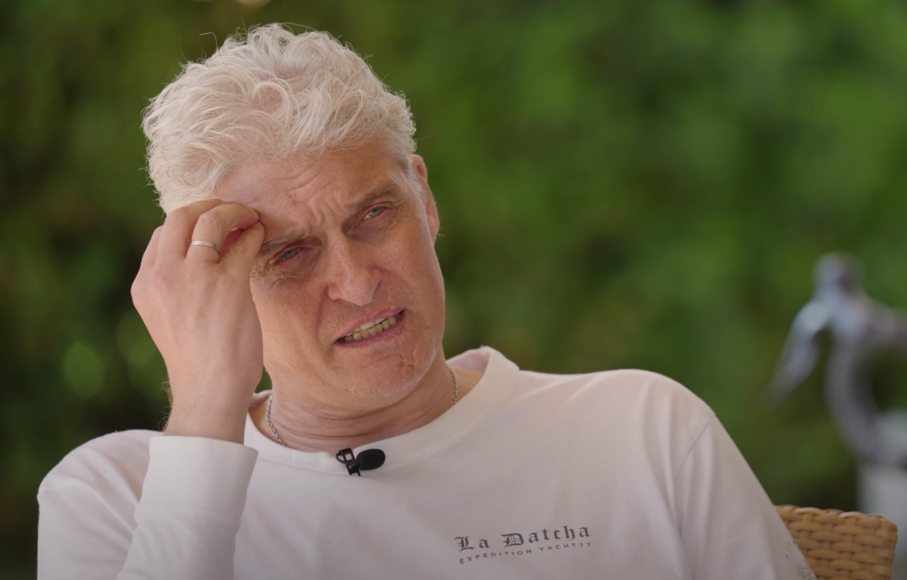

## Евгений Колоколов. Интервью

_В честь урока номер 100 мы сделали интервью с Евгением [@kolokolovea](https://t.me/kolokolovea)!_

_Женя – Java-разработчик, который принимает активное участие в жизни этого паблика/чата. Мы решили немного узнать о нём
и рассказать вам._

_Если у кого-то останутся вопросы, то смело задавайте их в чате😊_

&nbsp;

**Привет, Жень, расскажи коротко о себе, сколько тебе лет, откуда ты, чем вообще занимаешься?**

Привет!

Ну, собственно, я Женя, мне 34. Я завсегдатай флудилки в проекте «Дорогу осилит идущий». Сейчас живу на Кипре с женой,
ребенком и котом. Родом я из Оренбургской области. Последние 7 лет пишу backend на Java и Kotlin в разных компаниях: от
монстров вроде Сбера или ВТБ, до ламповых компаний России вроде red_mad_robots. Ну и пару стартапов я естественно
посетил, куда ж без этого=)

&nbsp;

**А расскажи, где сейчас трудишься, сколько времени работаешь в нынешней компании, на какой позиции? Чем, в целом,
занимается компания? Если не секрет, над каким продуктом работаешь конкретно ты?**

Сейчас я работаю в компании FxPro — это форекс-провайдер для торговли валютой и акциями. В компании я работаю год, на
позиции Senior Java Developer.

Как я и сказал, компания предоставляет инструменты для торговли различными активами на бирже. Я занимаюсь
непосредственно развитием и поддержкой «ядра» процессинга. Я пишу то место, где происходит магия сделок. Вот ты зашёл в
свой личный кабинет, выбрал акции или валюту, нажал «купить», и через полсекунды акция у тебя в кармане. Вот я делаю
так, чтобы это было быстро, безопасно и корректно.

Если более интересно по требованиям и архитектуре, то это highload и low latency монолит с микросервисами вокруг. Есть
Spring (Boot, в том числе), PostgreSQL, Kafka. Недавно перешли на Java 17. Увы, есть и Lombok, и JPA (которые я очень не
люблю), но это такая ложка дёгтя в бочке мёда.

Мы обрабатываем тысячи эвентов в секунду, а итоговое время исполнения измеряется в миллисекундах. Потеря 50 миллисекунд
на исполнение для нас весьма ощутима, мы стараемся такого не допускать.

Команда у нас небольшая, но все очень классные (тем более, что половину я сам нанимал😄)

Вообще очень интересно: требования highload и low latency заставили на многие вещи посмотреть с другой стороны. Может,
как-то в будущем расскажу об этом.

&nbsp;

**Мы будем ждать интересных статей, мы запомнили😊 Расскажи, где и на какую специальность ты учился? Если профессия не
связана с разработкой, то расскажи, как и почему оказался в сфере IT?**

О, учился я в Оренбургском Государственном Аграрном Университете на специальности «Автоматизированные Системы
Обработки Информации и Управление». Это такой «Computer Science на минималках»😄. То есть, когда ты такой факультет
заканчиваешь, то ты выходишь в мир «ни тем, ни сем». Ты как бы и не системный администратор, и не программист, и не
управленец (хотя нам говорили, что мы будущие управленцы). Поэтому, с одной стороны, у меня есть диплом IT, с другой
стороны знаний в конкретной области почти не было.

&nbsp;

**А работал когда-нибудь по своей специальности? Если да, то какие были ощущения?**

На четвёртом курсе я немного подрабатывал тестировщиком. На пятом - устроился «инженером-электронщиком»: несмотря на
название должности, я, по факту, просто принтеры заправлял и иногда сетку тянул. Потом меня бывший однокурсник взял к
себе помощником системного администратора и понеслась: сети, сервера, роутеры, AD, почта, телефония и так далее. В
общем, не заметил, как пролетели 5 лет системного администрирования.

Работа, в общем, была интересной, но, во-первых, не очень оплачиваемой (я к тому моменту уперся в потолок в 35к рублей),
а, во-вторых, хотелось то программы делать, а не бегать как угорелый по городу и выяснять «почему у Светланы Ивановны
принтер не работает».

&nbsp;

**Я уверен, что в детстве ты, как и многие, размышлял о том, кем станешь, когда вырастешь. Кем ты себя представлял? Как
тебе кажется, получилось ли хоть немного приблизиться к детской мечте?**

Ну, я не очень хорошо помню свои мечты и ощущения до лет 14, наверное. А вот уже в подростковом возрасте я отчетливо
помню, что хотел стать программистом.

Я тогда не очень понимал, что это значит, но мне нравилось ковыряться в компьютерах в школе, в классе информатики. Я не
представлял, как я буду выглядеть со стороны. Ну как, знаешь, космонавт представляется в скафандре, а певец с микрофоном
на сцене. Но мне нравилось, что у компьютеров очень «регламентированный» язык общения и мне хотелось этим заниматься. Ну
и как можешь догадаться, мне удалось приблизиться, но не без сложностей.

&nbsp;

**У тебя есть какое-то хобби, может их несколько, расскажи. В целом, как ты отдыхаешь и проводишь свое свободное
время?**

По поводу хобби - у меня их достаточно много. Я часто хватаюсь за всякие дела, которые мне нравятся, но никогда не
довожу их до высокого уровня😄

Например, я умею играть на гитаре и делаю это уже лет 15, но играю на уровне 3-4 лет обучения, потому что делаю это
«когда хочется». Или меня как-то увлек Кубик Рубика. Я сперва его просто собирал, потом собирал на скорость. В итоге мой
рекорд - 26 секунд, что, мягко говоря, далеко от хоть сколько-то значимых показателей. Кстати, могу посоветовать кубик
и гитару как «настольное хобби». Сидишь, пишешь код. Мозг начинается плавиться - просто берешь и собираешь пару раз
кубик, или мелодию какую-то играешь. Чисто механические действия. И, вроде, отвлекся, и из контекста не вывалился.
Супер.

Еще люблю компьютерные игры (они отчасти вовлекли меня в профессию). Играю во все, от WoW до Марио😄. Занимался вокалом,
настольным теннисом, акробатикой на батутах.

Раньше на выходных я много работал, поэтому отдыхал за приставкой или гитарой. Сейчас мы с семьёй просто выбираемся на
какой-нибудь пляж или в горы и там вместе проводим время.

&nbsp;

**Здорово! Я думаю, что у каждого из нас есть момент в жизни, когда мы понимаем: это вот прям «наше». Наш человек
или что-то другое, вот расскажи про момент, когда ты понял, что будешь разработчиком?**

Как я сказал, учился я на инженера, но я отчётливо помню момент, когда я понял, что точно стану программистом, и куда
пойду учиться. Это была «профориентация» в 9 классе, где нам в сельском ДК рассказывали про разные учебные заведения,
и дядька один с трибуны так вещал про «самый лучший университет по компьютерам в области», что я решил - пойду туда.
Хотя, если бы был умнее, то выбрал бы другой универ где-то в Питере или Москве, благо баллы ЕГЭ позволяли.

После универа, как и говорил, я работал админом. Я не писал код, а, в основном, занимался проектированием сетей,
закупкой оборудования, авторским надзором, монтажом и так далее. В общем такой «менеджер вокруг всего компьютерного».

У меня есть друг (Серёжка, привет), с которым мы познакомились в университете (он учился на курс младше). Он оказался
умнее меня и не стал «админить», как это было принято, а пошёл тестировщиком и параллельно учил программирование. Потом
уехал в Питер.

Вот я, как сейчас помню, что 6 марта 2016 он позвонил мне узнать, как дела, и предложил помощь с переездом, если я найду
работу прогером. У меня что-то, видимо, стрельнуло в мозгу, потому что в этот же день я зашел в Гугл и вбил в поиск
«самые популярные языки программирования». Потом из списка взял верхние 10. По каждому из них гуглил картинки(!) и
смотрел, как код выглядит визуально (ну, то есть я совсем не понимал, что там написано, но пытался понять, нравится мне
или нет). Ну а дальше учёба, учёба, учёба.

&nbsp;

**Сергею огромный привет😄 А какой у тебя общий опыт работы на Java? Может, есть опыт работы в других языках
программирования? Расскажи в целом как пришел в Java, с чего всё началось? Ну, и про другие языки немного.**

Помнишь, что я выбирал язык программирования «по картинкам»? Так вот, я получил примерно следующее:

- В JS мне не понравились вставки из HTML и `===`.
- В PHP - подчеркивания в названиях переменных и знак `$`
- В Python - отсутствие фигурных скобок `{}`
- С++ показался вырвиглазным.

А вот Java мне показался «понятным», возможно, потому что немного похож на Delphi или Turbo Pascal, который мы
«проходили» в универе. Короче, выбирал душой😄. Так Java стал моим основным языком (о чём ни разу не жалею).
Периодически проскакивали C# и Kotlin, но они очень похожи на Java. Ещё был печальный опыт поддержки чужого кода на
JavaScript, но именно тогда я понял, что точно никогда не буду фронтендером😄. А, диплом ещё в универе писал на Delphi
7, но там вообще «гасите свет»=)

Ещё совсем немного щупал Go, PHP, Python. Сейчас планирую потыкать в Rust.

Вообще все объектно-ориентированные языки очень похожи друг на друга. Как, например, машины. Может у тебя будет не
седан, а хэтчбек, или не на ручной коробке, а на автомате, но принципы везде плюс-минус одинаковые. Это, кстати,
причина, почему всякие FAANG* не ищут людей на конкретный язык.

> *FAANG – имеется ввиду крупные IT-гиганты, акроним от Facebook, Amazon, Apple, Netflix и Google.

Еще Java все ругают за многословность, а мне, наоборот, нравится. Приходится сильно извернуться, чтобы написать
какую-нибудь дичь.

&nbsp;

**Как ты вообще учился прогать? Что-то дал универ или, в основном, всё сам? Что использовал/используешь: курсы,
свободные источники? Сколько времени уделял/уделяешь учёбе? В данный момент как прокачиваешь свои скиллы, кроме 
работы?**

Ну, понятно, что в университете у меня был курс «программирование», но мы на нём, в основном, в контру 1.6 по сетке
рубились😄. Поэтому считаю, что учился сам. Первый раз, когда оказалось, что на 5 курсе надо писать диплом, а
второй - когда уже осознанно решил взяться за профессию.

Я плохо воспринимаю статьи, а ещё хуже воспринимаю книги, поэтому мой выбор остановился на видео. Я тогда нашёл классный
курс по Java Core от Ивана Головача и шёл прямо по нему. Смотрел лекцию, потом гуглил непонятные моменты по пройденному
материалу, писал тестовые задачи, по некоторым моментам читал статьи. Как только понимал, что осознаю, о чём речь - шёл
дальше. Сейчас, конечно, курс уже староватый, но я бы всё равно посоветовал. Только там несколько потоков - я смотрел за
13 год. По всяким спрингам я тогда не нашёл похожих курсов, но сейчас наверняка что-то такое есть.

Времени на обучение я выделял столько, сколько мог набрать в сутках. Я приходил с утра на работу к 9. За пару-тройку
часов делал всю текучку, и где-то с 12 садился и начинал учить программирование. А что, очень удобно: сидит админ -
кнопки в компьютер тыкает. Вроде всё, как и должно быть😄. После 6 вечера ехал полчаса до дома, там ужин, полчаса-час
на игры с сыном, и опять чтение или кодинг. В рабочий день выходило примерно 6-8 часов. Иногда, может, чуть меньше.

На выходных делал какие-то дела и опять шёл писать код, смотреть видео, или читать статьи. Даже семью отправлял
«гулять», чтобы не отвлекали. На выходных могло выходить по 10 часов, а могло полчаса-час. Так что, я примерно считаю,
45-50 часов в неделю.

Уже после того, как я начал работать программистом и получил хоть какие-то знания, я начал читать книги, чтобы
структурировать их. Посоветовать могу O’Reilly «Designing Data-Intensive Applications» и «Building Microservices». Но
моя любимая - Эндрю Таненбаума, "Архитектура компьютера". Мне кажется, must have для программиста. Читается как
художественная литература. Ну и митапчики, конференции и «курилка» с коллегами.

&nbsp;

**В начале карьеры ты ведь проходил собесы, были отказы по-любому. Какой собес из начальных запомнился больше всего, и
чем? Много ли отказов ты встретил на своем пути?**

С собеседованиями у меня достаточно плотные отношения. Вообще всем стоит понимать, что умение работать и умение
проходить собеседования - два разных скилла, которые надо раздельно качать. Ты можешь быть трижды крутым
программистом, но, если не умеешь продать себя на собеседованиях, то придётся довольствоваться второсортными
вакансиями.

Моё первое собеседование было очень простым. Что-то спросили про базовый синтаксис и дали тестовое задание с
использованием Swing. Я за день сделал его и отправил - так получил первую работу.

В какой-то момент компания, где я работал, получила проект на субподряде, и нам пришлось проходить собеседование у
контрагента. Я подготовился по «Топ-100 вопросов по Java», и успешно его прошёл. Потом было ещё с десяток таких
собеседований, и все они были похожи друг на друга. Везде одинаковые вопросы, и даже в одинаковом порядке. Также мы
нанимали людей, и я туда тоже подключался, чтобы смотреть, как люди отвечают.

Из фейловых собесов мне больше всего запомнился в Revolut в 2019. Там задавали вопросы про многопоточку, микросервисы,
нагрузки, балансировки, виртуализацию и так далее. А я привык отвечать на вопросы про устройство HashMap😄.

Тогда я понял две вещи:

1. Я очень мало знаю об архитектуре.
2. Мне срочно нужен английский язык.

Когда проходишь много собеседований, отказы случаются всё реже и реже, потому что мало интервьюеров блещет
индивидуальностью. Все вопросы плюс-минус одинаковые. Да и на результаты ты начинаешь забивать, потому что цель - не
устроиться, а «провести разведку». Начинаешь меньше нервничать, и результаты становятся лучше. В какие-то моменты я
дошёл до такого уровня, что заранее знал, что спросит интервьюер, даже специально узнавал какие-то вопросы чуть глубже.
Это позволяло произвести впечатление на собеседующего.

Так у меня появилось хобби: проходить собеседования. Я прохожу, в среднем, 15-20 собеседований за год (последний год -
исключение). Просто, чтобы быть в тонусе, знать, что спрашивают, каких ответов ждут и что могут предложить в виде
бонусов. Провожу и сам много собеседований - около 350 за 7 лет.

&nbsp;

**Хорошее хобби. Добавим его в ряд к гитаре и кубику😄. Расскажи про свой самый большой фейл на работе, как 
выкручивался из него?**

Я уже постил, вроде, эту историю во флудилку, но многие, наверное, её пропустили:

Я как-то писал бэкенд для одного муниципалитета. Я был «one-man army», один за всех, и писал весь бэк в соло. Там был
кейс, который при «нормальном» взаимодействии не мог произойти, а мог возникнуть только в момент «атаки» или ошибки
программиста. В этом кейсе я кидал исключение, из которого хендлер брал сообщение, оборачивал его в сообщение и
отправлял клиенту. Я, когда писал код, думал, какое сообщение придумать, и решил, что придумаю попозже. А так, на время,
чтобы не забыть, написал в сообщении «Ху*ня какая-то». Естественно, я это забыл и залил в продакшн. И там оно крутилось
около года. Потом клиент решил своими силами дорабатывать продукт, и они первый раз заглянули в исходники😄. Я, правда,
тогда уже работал на другом продукте, но пришлось менеджера просить принести от меня извинения.

Так я выработал для себя правило: не писать нецензурную брань в коде. Даже на время. (Правило это недавно опять нарушил,
что позволило опять себе напомнить, что так лучше не делать).

&nbsp;

**Ты говорил про Кипр. Расскажи, какие ощущения от страны? Какие есть плюсы, минусы для тебя, что тебе там нравится/не
нравится?**

Да, я полтора года базируюсь на Кипре. Пока что всё очень нравится, но не хватает зимы, поэтому мы зимой гоняли в горы и
там «щупали» снег.

Очень классно, что местные достаточно дружелюбные. Всегда улыбаются, здороваются. Да и культуры наши очень похожи.
Русский алфавит многое взял из греческого. И православие заимствовало многое.

Есть, конечно, вещи, которые не нравятся. Это низкий уровень сервисов: открыть счёт в банке, перевести деньги или
заказать такси - целый квест. Нет привычных сбербанков, тиньковых, яндексов и т.д. Иногда в госструктурах тебе могут
позвонить и потребовать с тебя номер карты и CVV для оплаты госпошлины😄. И это тут нормально.

А ещё местные очень спокойные, что выливается в медлительность и необязательность. Тут «быстро» - это две-три недели.
Очень быстро - неделя. Прям моментально - 3 дня. Даже не стоит рассчитывать, что ты можешь какое-то дело закрыть одним
днём.

И ещё общественный транспорт - отдельная боль на Кипре. Он есть, но он очень неудобный. Ходит редко и далеко не везде.
Без машины практически невозможно жить.

Но, конечно, море, солнце и пляжи перекрывают почти все недостатки😄

&nbsp;

**Ну давай тогда быстро (но не так как на Кипре😄) ещё пару вопросов. Как ты попал сюда, в этот чатик?) Зачем тебе
это всё, какая мотивация отвечать и помогать новичкам?**

Так сложилось, что почти во всех компаниях, в которых я работал, я рано или поздно устраивал какие-то обучающие
мероприятия. Начиналось всё с того, что я просто делился знаниями с ребятами из команды, а потом подтягивались другие
люди. Мне просто нравится делиться знаниями. Ну и часто ребята, которые плохо понимают в предмете, задают такие
вопросы, на которые ты не знаешь ответа. Это позволяет под другим углом смотреть на проблему. А ещё, когда готовишься
к лекции или докладу, приходится глубже вникать в конкретную тему. Это также позволяет углубиться.

Я даже как-то сам писал на Пикабухе, что могу помочь желающим, но желающих оказалось немного (точнее, организовал я
тогда всё так себе). Поэтому, когда я увидел, что Егор собирает чатик, я решил посмотреть, что у него получится. А
получилось у него весьма круто. Не представляю, сколько сил он на это тратит. Это реально титанический труд. Большой ему
респект. Ну и я решил, что тоже буду помогать.

Я даже вызвался провести онлайн лекции по некоторым темам, но были более приоритетные задачи (по работе и жизни). Так
что, возможно, в сентябре вернусь к этой идее.

&nbsp;

**И давай несколько напутственных слов для ждунов и не только.**

Начинающим разработчикам могу посоветовать следующее:

- Всегда задавайте себе вопрос «зачем?». Зачем вы решаете ту или иную задачу. Зачем вы используете конкретный алгоритм.
Зачем вы пишете новый модуль. Зачем вы тестируете, и так далее. Первопричина всегда самая важная. Если не понимаете,
зачем нужно то, что вы делаете - есть вероятность, что вы делаете не то, что нужно.
- Невозможно все знать, и это нормально.
- Помните, что читаемость кода НАМНОГО важнее скорости его написания. Если вы экономите на названии переменной или 
  метода 1 минуту, то в будущем это выльется в целые человеко-часы попыток осознания, что происходит.
- Будьте к себе максимально строги. Не бывает «неважных» мелочей. Все важное часто именно в мелочах.
- Помните, что задача программиста не «писать код», а решать проблемы бизнеса. Если для этого понадобится писать код -
  хорошо. Если не понадобится - еще лучше.

А так, желаю всем удачи!

Как говорится - дорогу осилит идущий😊.

Ну, и я всегда доступен в чатике и в личке. Приходите с вопросами - с удовольствием отвечу. Всем пока❤️

&nbsp;

**Спасибо большое Евгению за ответы, Егору за публикацию, мы все очень надеемся, что вам понравилось, ставьте лайки,
подписывайтесь на канал, нажимайте на колокольчик, пока-пока.**

> Канал: https://t.me/ViamSupervadetVadens
>
> Лучший интервьюер Владислав: https://t.me/PuccaPavle
>
> Наш завсегдатай Евгений: https://t.me/kolokolovea
>
> Редактор Алексей: https://t.me/legrandemojave
>
> Дорогу осилит идущий!
